# overthewire.org/wargames/bandit/

## case exit ssh & exit user & create user & enter user

##  Bandit Level 0 Level Goal
## The goal of this level is for you to log into the game using SSH. The host to which you need to connect is bandit.labs.overthewire.org, on port 2220. The username is bandit0 and the password is bandit0. Once logged in, go to the Level 1 page to find out how to beat Level 1.

### Create user bandit0 - sudo adduser bandit0
### Switch user - sudo su bandit0
### Connect SSH

## Bandit Level 0 → Level 1
### Level GoalThe password for the next level is stored in a file called readme located in the home directory. Use this password to log into bandit1 using SSH. Whenever you find a password for a level, use SSH (on port 2220) to log into that level and continue the game.

#### check files  - "ls"
#### read files - "cat"
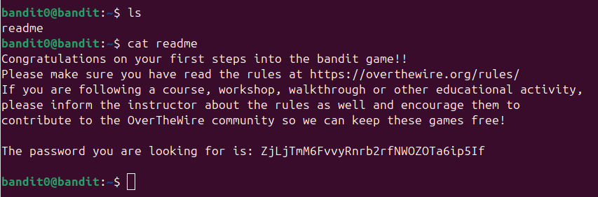
#### psswrd - "ZjLjTmM6FvvyRnrb2rfNWOZOTa6ip5If"
#### switch - "su *name*"
#### create bandit1 - "sudo adduser"

#### connect SSH port 2220
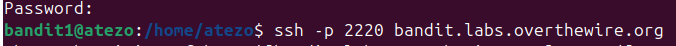

## Bandit Level 1 → Level 2
### Level Goal The password for the next level is stored in a file called - located in the home directory
#### exit dir - cd ../
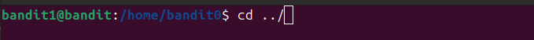
#### check files
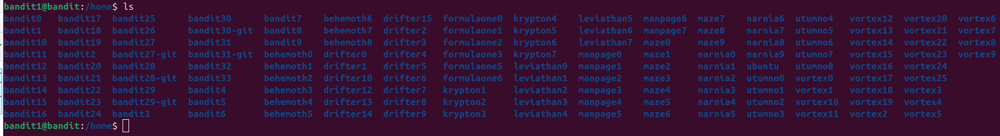
#### quit bandit1
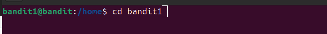
#### check files and read

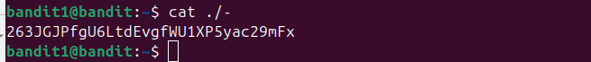

- (cat ./ - open hard name files)
#### psswrd: 263JGJPfgU6LtdEvgfWU1XP5yac29mFx
## Bandit Level 2 → Level 3
### Level Goal The password for the next level is stored in a file called --spaces in this filename-- located in the home directory
#### "ls"
#### "cat ./"
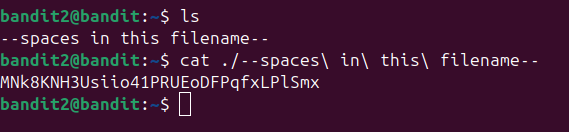
#### psswrd: MNk8KNH3Usiio41PRUEoDFPqfxLPlSmx
## Bandit Level 3 → Level 4
### Level Goal The password for the next level is stored in a hidden file in the inhere directory.
#### check files - "ls"
#### enter enhere - "cd enhere/"
#### check all files - "ls -la"
#### open hidden file - "cat ...Hiding-From-You"
#### psswrd - "2WmrDFRmJIq3IPxneAaMGhap0pFhF3NJ"

## Bandit Level 4 → Level 5
### Level Goal The password for the next level is stored in the only human-readable file in the inhere directory. Tip: if your terminal is messed up, try the “reset” command.
#### check files "ls -la"
#### read all file names files - "cat ./file*"
#### see fake psswrd oyv4oQYVPkxZOOEOO5pTW81FB8j8lxXGUQw
#### check all file09 -> file07 search password
#### cat ./-file07 - "4oQYVPkxZOOEOO5pTW81FB8j8lxXGUQw"
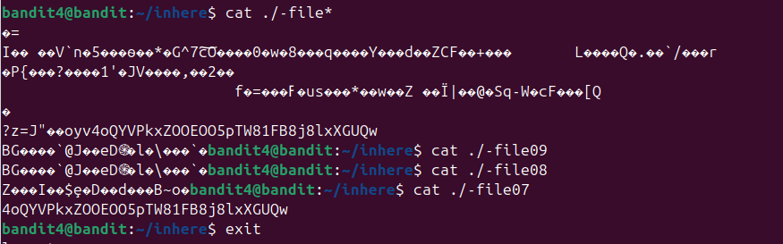
## Bandit Level 5 → Level 6
### Level Goal The password for the next level is stored in a file somewhere under the inhere directory and has all of the following properties:
- human-readable
- 1033 bytes in size
- not executable
#### check dir and go /inhere
#### Looking files command - "find ~ -type f -size 1033c ! -executable"
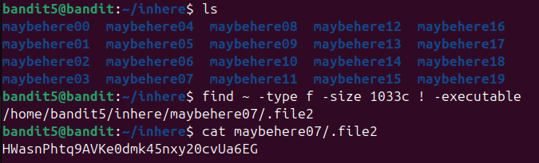
#### psswrd: "HWasnPhtq9AVKe0dmk45nxy20cvUa6EG"
## Bandit Level 6 → Level 7
### Level Goal The password for the next level is stored somewhere on the server and has all of the following properties:

    owned by user bandit7
    owned by group bandit6
    33 bytes in size

### find / -type f -user bandit7 -group bandit6 -size 33c
#### result witch errors - "find / -type f -user bandit7 -group bandit6 -size 33c"
#### remove errorrs add ls - "find / -type f -user bandit7 -group bandit6 -size 33c -ls 2>/dev/null>"
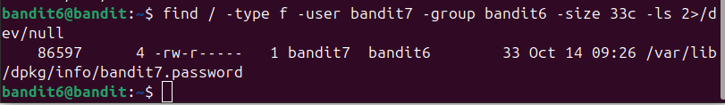
#### cat /var/lib/dpkg/info/bandit7.password
#### psswrd "morbNTDkSW6jIlUc0ymOdMaLnOlFVAaj"
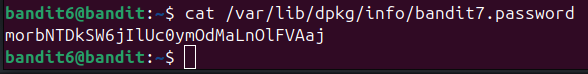
## Bandit Level 7 → Level 8
### Level Goal The password for the next level is stored in the file data.txt next to the word millionth
#### "grep millionth data.txt"
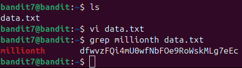
#### psswrd "dfwvzFQi4mU0wfNbFOe9RoWskMLg7eEc"

## Bandit Level 8 → Level 9
### Level Goal The password for the next level is stored in the file data.txt and is the only line of text that occurs only once
#### sort data.txt | uniq -u
#### psswrd "4CKMh1JI91bUIZZPXDqGanal4xvAg0JM"
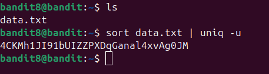
## Bandit Level 9 → Level 10
### Level Goal The password for the next level is stored in the file data.txt in one of the few human-readable strings, preceded by several ‘=’ characters.
